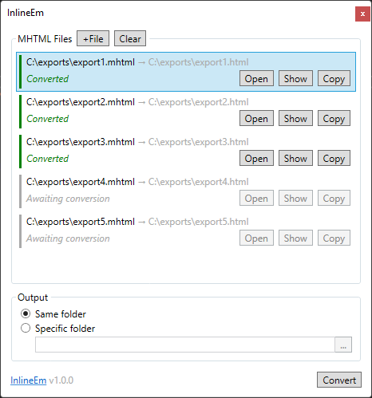

# InlineEm

A small Windows utility to inline image attachments in [MHTML][mhtml] files (``)
as [Base64 data URLs][base64] using [MimeKit][mimekit] and [HTML Agility Pack][html-agility-pack].

The "core" conversion logic is in [`Inliner.cs`][Inliner].

 

## To Do

- [ ] [`MainViewModel`][MainViewModel] has too much in it; re-organise.
- [ ] Comments.
- [ ] Report unresolved attachment IDs as warnings during conversion.
- [ ] Allow dropping MHTML files into the "MHTML Files" pane.
- [ ] Allow adding folders to [recursively?] discover all MHTML files within it.
- [ ] Implement converters as XAML markup extensions.
- [ ] Releases.
  - [ ] Installer?
  - [ ] Build automation?
  - [ ] Updates?

 

## Contributing

Open the [`InlineEm.sln`][sln] solution within [Visual Studio][vs] with the _.NET desktop
development_ workload and the following extensions installed,

- [XAML Styler](https://marketplace.visualstudio.com/items?itemName=TeamXavalon.XAMLStyler2022)
- [Editor Guidelines](https://marketplace.visualstudio.com/items?itemName=PaulHarrington.EditorGuidelines)
- [Markdown Editor](https://marketplace.visualstudio.com/items?itemName=MadsKristensen.MarkdownEditor64)

[mhtml]: https://en.wikipedia.org/wiki/MHTML
[base64]: https://developer.mozilla.org/en-US/docs/Web/HTTP/Basics_of_HTTP/Data_URLs
[mimekit]: http://www.mimekit.net
[html-agility-pack]: https://html-agility-pack.net
[vs]: https://visualstudio.microsoft.com

[sln]: ./InlineEm.sln
[MainViewModel]: ./InlineEm.Gui/ViewModels/MainViewModel.cs
[Inliner]: ./InlineEm.Lib/Inliner.cs
